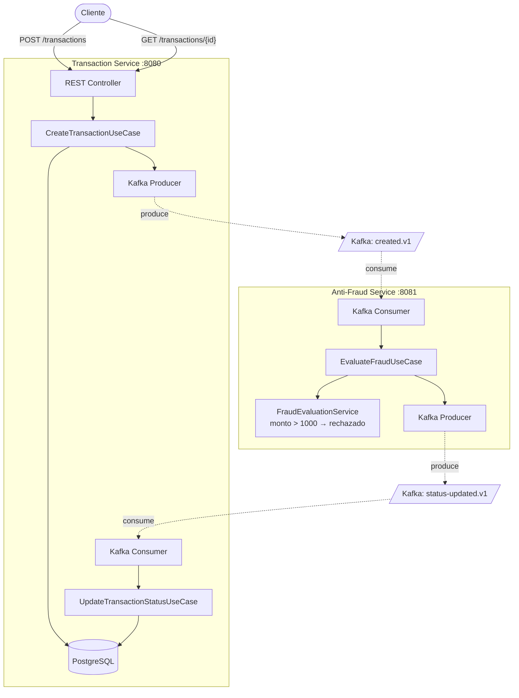
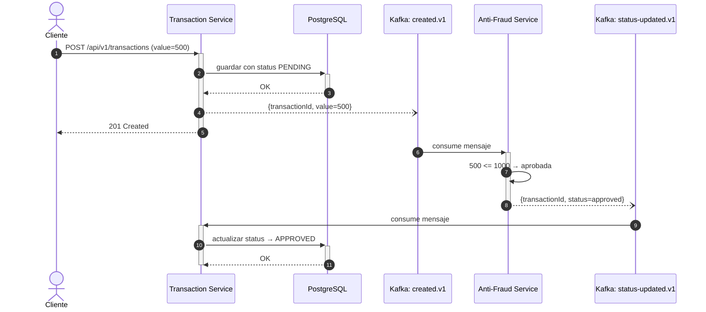

# Yape Code Challenge | Sistema Anti-Fraude

Sistema de validación anti-fraude para transacciones financieras. Dos microservicios en **Java 21** y **Spring Boot 3.4** que se comunican por **Kafka** de forma asíncrona, con **PostgreSQL** como base de datos.

Cada servicio sigue Arquitectura Hexagonal: el dominio no depende de ningún framework, toda la lógica de negocio está aislada y es testeable sin infraestructura.

---

## Inicio rápido

Para ejecutar el proyecto se necesita Docker. Asegurar que los puertos `8080`, `8081`, `5432` y `9094` estén libres:

```bash
docker compose up --build
```

Una vez que los contenedores estén ejecutándose, se pueden probar los endpoints:

Crear una transacción (monto <= 1000, se aprueba):

```bash
curl -s -X POST http://localhost:8080/api/v1/transactions \
  -H "Content-Type: application/json" \
  -d '{
    "accountExternalIdDebit": "550e8400-e29b-41d4-a716-446655440000",
    "accountExternalIdCredit": "6ba7b810-9dad-11d1-80b4-00c04fd430c8",
    "transferTypeId": 1,
    "value": 500
  }'
```

Crear una transacción (monto > 1000, se rechaza):

```bash
curl -s -X POST http://localhost:8080/api/v1/transactions \
  -H "Content-Type: application/json" \
  -d '{
    "accountExternalIdDebit": "550e8400-e29b-41d4-a716-446655440001",
    "accountExternalIdCredit": "6ba7b810-9dad-11d1-80b4-00c04fd430c9",
    "transferTypeId": 1,
    "value": 1500
  }'
```

Consultar una transacción (reemplazar `{id}` con el ID de la respuesta anterior):

```bash
curl -s http://localhost:8080/api/v1/transactions/{id}
```

### Errores

| Código | Cuándo |
|--------|--------|
| 400 | Campos faltantes, monto negativo, cuentas débito y crédito iguales |
| 404 | Transacción no encontrada |
| 500 | Error interno |

---

## Arquitectura



| Servicio | Puerto | Qué hace |
|----------|--------|----------|
| **Transaction Service** | 8080 | API REST, persiste transacciones en PostgreSQL, publica y consume eventos Kafka |
| **Anti-Fraud Service** | 8081 | Evalúa fraude por monto, sin base de datos propia (stateless) |

---

## Flujo de una transacción



---

## Tecnologías

| Tecnología | Versión | Por qué |
|------------|---------|---------|
| Java | 21 LTS | Records, pattern matching, sealed classes |
| Spring Boot | 3.4.3 | Integración nativa con Kafka, auto-configuración, actuator |
| PostgreSQL | 16 | NUMERIC(15,2) para montos financieros, ACID |
| Apache Kafka | 3.8.1 (KRaft) | Mensajería asíncrona sin Zookeeper, productor idempotente |
| Flyway | via Spring Boot | Migraciones de base de datos versionadas |
| JUnit 5 + AssertJ | via Spring Boot | Tests sin necesidad de infraestructura |

---

## Decisiones de diseño

### Arquitectura Hexagonal

El dominio no conoce ni depende de Spring, Kafka, JPA ni ningún framework. Toda comunicación con el exterior pasa por interfaces (puertos) que se implementan con adaptadores concretos.

Esto permite testear toda la lógica de negocio sin levantar base de datos, sin Kafka, sin servidor HTTP. Si desea cambiar de PostgreSQL por MongoDB, solo se reemplaza el adaptador de persistencia y el dominio no se toca.

### Modelo de dominio

Cada microservicio tiene su propio contexto acotado. `Transaction` es el agregado raíz que encapsula las reglas de creación, aprobación y rechazo. `FraudEvaluationService` es un servicio de dominio puro que aplica la regla de fraude (monto > 1000 se rechaza) sin conocer Kafka ni ninguna otra dependencia externa.

Las transiciones de estado están protegidas: solo una transacción en estado `PENDING` puede pasar a `APPROVED` o `REJECTED`.

### Kafka

| Decisión | Razón |
|----------|-------|
| KRaft (sin Zookeeper) | Simplifica la operación, es el modo recomendado desde Kafka 3.3 |
| Nombrado de topics: `yape.transaction.event.created.v1` | Sigue la convención `org.dominio.tipo.nombre.version` |
| Productor idempotente con `acks=all` | Previene duplicados y garantiza entrega |
| TransactionId como clave del mensaje | Garantiza orden de procesamiento por transacción |
| Grupos de consumidores dedicados | Cada servicio consume de forma independiente |

### Virtual Threads (Java 21)

Ambos servicios hacen mucho I/O (queries a base de datos, envíos a Kafka). Con virtual threads habilitados (`spring.threads.virtual.enabled: true`), Spring Boot usa threads virtuales para Tomcat, listeners de Kafka y tareas asíncronas. Esto elimina el cuello de botella del pool de threads fijo sin cambiar código de aplicación.

---

## Estructura de cada servicio

Ambos microservicios siguen la misma organización de paquetes:

```
service/
├── domain/                          # Sin dependencias de framework
│   ├── model/                       # Agregados, value objects, enums
│   ├── event/                       # Eventos de dominio
│   ├── exception/                   # Excepciones de dominio
│   ├── service/                     # Servicios de dominio (lógica pura)
│   └── port/
│       ├── in/                      # Casos de uso (interfaces) + comandos
│       └── out/                     # Repositorio, publicador de eventos (interfaces)
│
├── application/service/             # Implementación de los casos de uso
│
└── infrastructure/
    ├── adapter/in/rest/             # Controladores, DTOs, manejo de errores
    ├── adapter/in/kafka/            # Consumidores Kafka
    ├── adapter/out/kafka/           # Productores Kafka
    ├── adapter/out/persistence/     # Entidades JPA, repositorios, mappers
    └── config/                      # Configuración de Kafka, Jackson, filtros
```

---

## Tests

```bash
cd transaction-service && ./mvnw test    # 16 tests
cd anti-fraud-service && ./mvnw test     # 15 tests
```

| Tipo | Qué valida | Necesita infraestructura |
|------|------------|--------------------------|
| Unitario (dominio) | Reglas de negocio, invariantes del agregado | No |
| Unitario (aplicación) | Casos de uso con repositorios en memoria | No |
| Unitario (consumidores) | Consumidores Kafka con publicadores falsos | No |
| Controladores | Endpoints, validación, manejo de errores | Solo Spring MockMvc |

---

## Observabilidad

### Logs estructurados

Todos los logs siguen un formato clave=valor consistente:

```
event=transaction.created, transactionId=uuid, value=500, status=PENDING, outcome=success
```

En desarrollo se usa texto plano legible. En Docker/producción se usa formato JSON para ingesta en herramientas de monitoreo.

### Trazabilidad entre servicios

Un `correlationId` viaja por todo el flujo: llega como header HTTP `X-Correlation-ID`, se propaga en los headers de Kafka, y aparece en todos los logs de ambos servicios. Si el cliente no lo envía, el sistema genera uno automáticamente.

---

## Seguridad

- Headers de seguridad en todas las respuestas HTTP (Content-Type-Options, Frame-Options, CSP, Referrer-Policy)
- Header del servidor oculto para no exponer tecnología
- Contenedores ejecutan con usuario no-root
- Dockerfiles multi-stage: JDK para compilar, solo JRE en la imagen final
- Validación de entrada con Bean Validation (`@NotNull`, `@Positive`, `@DecimalMax`)
- Errores genéricos al cliente, sin stack traces ni detalles internos
- IDs con UUID para no exponer secuencia ni volumen
- Paquetes confiables de Kafka restringidos (no se usa wildcard `*`)

---

## Estrategia de alto volumen

> *¿Cómo manejar escenarios de alto volumen con muchas escrituras y lecturas simultáneas sobre los mismos datos?*

### Lo que ya está implementado

| Estrategia | Cómo | Beneficio |
|------------|------|-----------|
| Virtual Threads | `spring.threads.virtual.enabled: true` | Millones de hilos concurrentes para operaciones de I/O |
| Particionamiento Kafka | TransactionId como clave, 3 particiones | Paralelismo entre particiones, orden por transacción |
| Productor Kafka idempotente | Ver sección Kafka | Sin duplicados, entrega garantizada |
| Pool de conexiones | HikariCP con tamaño configurable | Uso eficiente de conexiones a la base de datos |
| Lecturas optimizadas | `@Transactional(readOnly=true)` en GET | Evita flush innecesario de Hibernate |
| Inserciones en lote | Hibernate `batch_size=20` + `order_inserts` | Menos ida y vuelta a la base de datos |
| Recolector de basura ZGC | `-XX:+UseZGC` en Docker | Pausas de GC menores a 1ms |
| Anti-fraude sin estado | Sin base de datos, escala con consumer groups | Escala horizontal sin coordinación |
| Actualización idempotente | Ignora si la transacción ya tiene estado final | Tolerante a mensajes duplicados |
| Índices en base de datos | Sobre `status`, `created_at`, `account_debit` | Consultas rápidas sin recorrer toda la tabla |

### Por qué no se usa Redis

PostgreSQL resuelve las consultas por UUID en pocos milisegundos. Redis lo haría más rápido, pero el riesgo supera la ganancia: las transacciones cambian de estado de forma asíncrona vía Kafka, y un cache mal invalidado mostraría estados incorrectos al usuario. En un sistema financiero eso no es un bug menor, es una pérdida de confianza. Además las transacciones se crean una vez y se consultan pocas veces, que no es el tipo de carga donde cache aporta valor.

### Por qué PgBouncer y no más conexiones directas

A medida que se levantan más instancias del servicio, la cantidad de conexiones a la base de datos crece rápido y PostgreSQL empieza a sufrir. PgBouncer actúa como intermediario: recibe todas las conexiones de las aplicaciones y las comparte con un número mucho menor de conexiones reales a la base. El resultado es que se pueden escalar los servicios sin saturar PostgreSQL. Es el mismo enfoque que usa OpenAI para manejar cientos de millones de usuarios.

### Escalamiento progresivo

E sistema escala con virtual threads, Kafka, pool de conexiones e índices. Si el volumen crece, el camino es: primero PgBouncer para multiplexar conexiones y réplicas de lectura en PostgreSQL, después evaluar Redis con una estrategia de invalidación bien diseñada (un Redis puesto a medias hace más daño que no tener cache), y para volúmenes mucho mayores patrones como Transactional Outbox y CQRS. Cada paso se da cuando las métricas lo justifiquen.
